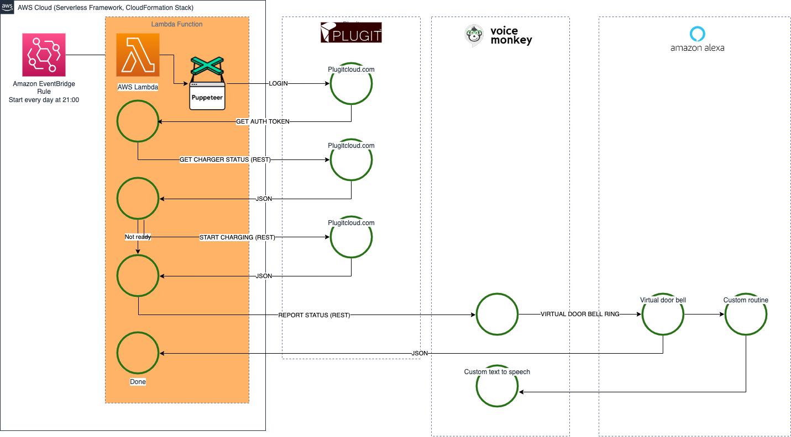

# Plugit Charger Control

Automatically start charging at 21:00 if the charcing cable is connected to the car

# Installation

- Run `yarn` to install the project dependencies

# Deployment

`API_KEY=webapikey PLUGIT_CHARGE_POINT_ID=123123 PLUGIT_CHARGE_BOX_ID=123123 PLUGIT_CHARGE_BOX_NUMBER=1234 PLUGIT_USERNAME='email@example.com' PLUGIT_PASSWORD='password' VOICEMONKEY_ACCESS_TOKEN=x VOICEMONKEY_SECRET_TOKEN=y VOICEMONKEY_MONKEY_ID=your-monkey-name AWS_PROFILE=default yarn sls --verbose deploy`

# Features
- Runs every night at 21:00 Finnish time
- Provides a URL for additional executions, requires `?apiKey=webapikey`
- Plugit values you need to reverse engineer from plugitcloud.com
- Voicemonkey values you need to get by registering at voicemonkey.io

## This application is in no way authorized or maintained by Plugit.
